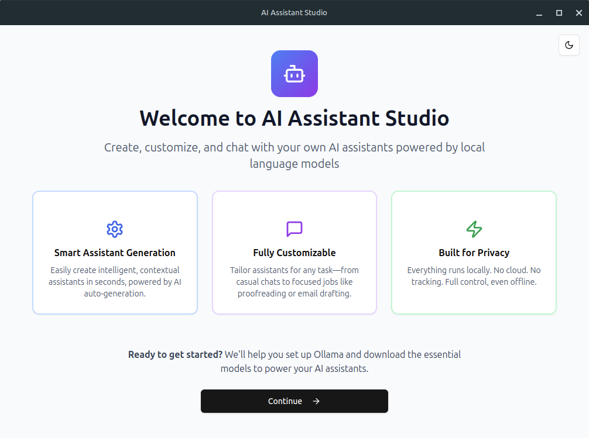
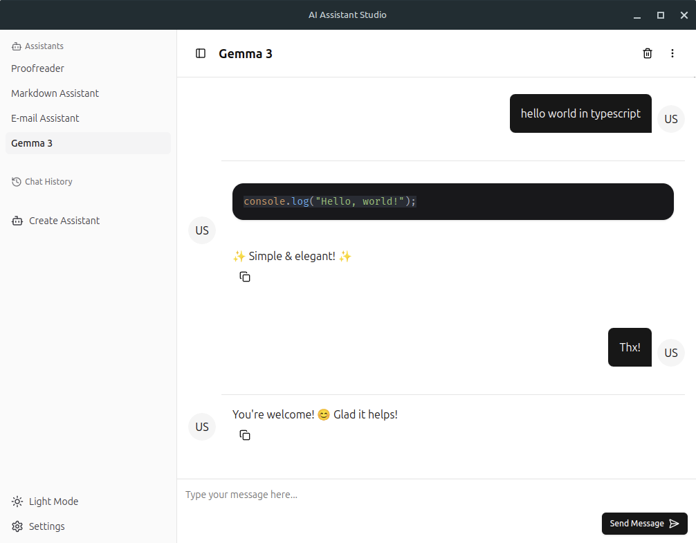
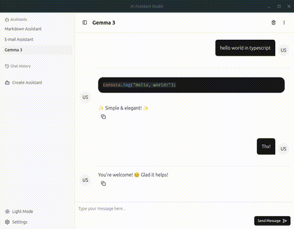

<p align="center">
  
</p>

<h1 align="center">AI Assistant Studio</h1>

<p align="center">
  Create, customize, and chat with your own AI assistants powered by local language models via <a href="https://ollama.com/">Ollama</a>.
</p>



## Features

⚡ **Create Assistants in Seconds**
Quickly set up helpful assistants just by describing what you need — like a proofreader, email helper, or markdown editor. The app handles the rest.

🎨 **Real-time Ollama Models Listing**
Models are pulled in real-time from the Ollama website, so you always see the latest available options — including custom variants created by the community.

📂 **Use Your Own Files for Context**
You can now connect assistants to your local files for smarter, more relevant responses. Just head to the assistant’s Advanced settings and choose a folder.

💬 **Keep Conversations Organized**
Keep your interactions organized with persistent history and support for multiple assistants.

🔒 **Local-Only by Design**
No servers, no cloud. Everything runs on your device and stays private.

⌨️ **Dynamic Shortcut Assignment**
Use a simple keyboard shortcut to bring up your assistant over any app — super handy when multitasking.

🛠 **Easy Setup**
A step-by-step guide helps you install everything you need and choose your models, no tech background required.

### 💻 Main App Interface

<!-- Insert main interface screenshot below -->



## Installation
[](https://github.com/gabrielborgesdm/ai-assistant-studio/releases)

Head to the [releases page](https://github.com/gabrielborgesdm/ai-assistant-studio/releases) and download the latest version for your operating system.

## 🎥 How It Works

### ✨ [Creating a Custom Assistant](https://youtu.be/4IcT_673Dac)

<p align="center"> <a href="https://youtu.be/4IcT_673Dac" target="_blank">  </a> </p>

In this video, I create a **Proofreader assistant** using **Task mode**, which is designed to respond only to the **latest user message**—perfect for focused, one-shot tasks like grammar correction or rewriting.

After generating the initial assistant, I also **adjust the system instructions** to better tailor its behavior to my specific needs. This allows the assistant to follow more precise guidelines, ensuring more accurate and helpful responses.

## 🗺 Roadmap

- ✅ Multiple assistant support with saved conversations
- ✅ Default assistants: Proofreader, Email Assistant, Markdown Helper, Multimodal (Gemma 3)
- ✅ Ollama model management with stream + cancellation support
- ✅ Modern UI powered by [Shadcn UI](https://ui.shadcn.com/) & [Shadcn Chat](https://github.com/jakobhoeg/shadcn-chat)
- ✅ Image upload for vision models (Base64 support)
- ✅ AI-powered assistant behavior + instruction auto-generation
- ✅ Live model listing with metadata and variants via Ollama scraping
- ✅ Dynamic keyboard shortcut support (Windows & Linux)
- ✅ Streamed markdown rendering with code block highlighting
- ✅ Welcome/setup onboarding screen
- ✅ Contextual search over local markdown files using Langchain
- 🔜 Planned: Multiple simultaneous chat sessions per assistant
- 🔜 Planned: Support for ChatGPT and other cloud model backends


## 📚 Tech Stack & Shoutouts

This project wouldn’t be possible without:

- [Electron](https://www.electronjs.org/)
- [Shadcn UI](https://ui.shadcn.com/)
- [Tailwind CSS](https://tailwindcss.com/)
- [react-markdown](https://www.npmjs.com/package/react-markdown)
- [react-syntax-highlighter](https://www.npmjs.com/package/react-syntax-highlighter)
- [Shadcn Chat](https://github.com/jakobhoeg/shadcn-chat)
- [shortcut-recorder-hook](https://github.com/BlazeStorm001/shortcut-recorder-hook)


## 🛠 Development

### Prerequisites

- [Node.js](https://nodejs.org/) (v16 or newer)
- [Yarn](https://yarnpkg.com/)
- [Ollama](https://ollama.com/) — required for running local models

### Install Dependencies

```bash
yarn
```

### Start in Development Mode

```bash
yarn dev
```

### Build for Production

```bash
# For Windows
yarn build:win

# For macOS
yarn build:mac

# For Linux
yarn build:linux
```
